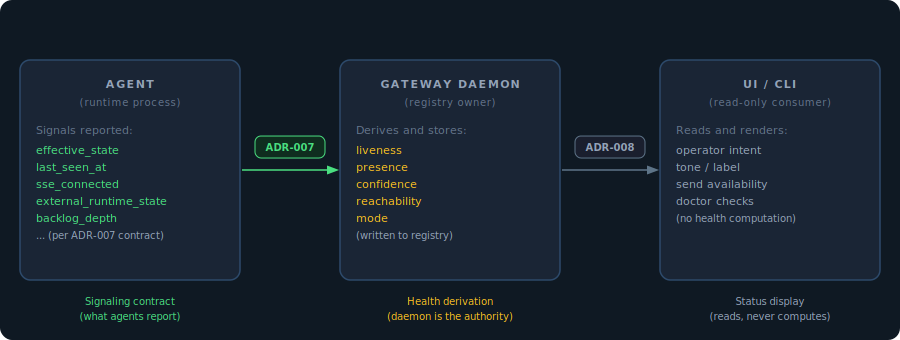
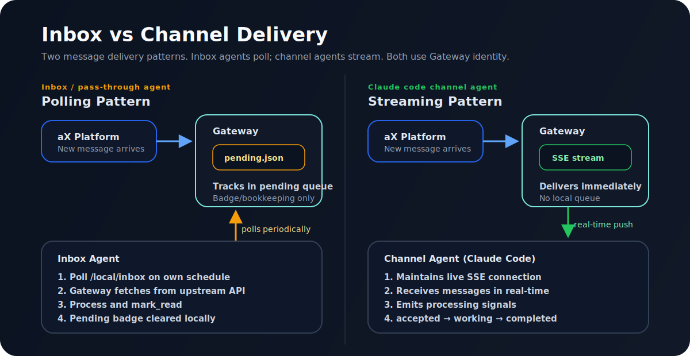

# ADR-007: Agent Classes and Gateway Signaling Contract

**Status:** Accepted — core agent classes reflect current implementation; boundary completion ongoing (see Known Gaps below)

## Context

The Gateway manages a growing set of agent types with fundamentally different
runtime models: some are processes the daemon starts and supervises directly,
others are external processes that report their own state, others are passive
mailboxes, and others are attached sessions the daemon cannot control. Without
a defined classification and signaling contract, each new agent type required
bespoke handling in the daemon sweep, the health derivation logic, and the UI.

This ADR defines the canonical agent classes and specifies what each class is
responsible for reporting to the Gateway registry.

This ADR (ADR-007) defines the left boundary: what each agent class is
responsible for reporting to the Gateway registry.
[ADR-008](ADR-008-agent-status-model.md) defines the right boundary: how the
daemon translates those signals into operator-visible status.

### Relationship to other specs

The five classes in this ADR are **signaling contract categories** — they
describe who owns the process lifecycle and how the agent reports health to the
local Gateway registry. They are distinct from the **asset taxonomy** defined in
[GATEWAY-ASSET-TAXONOMY-001](../../specs/GATEWAY-ASSET-TAXONOMY-001/spec.md),
which describes what kind of thing an asset is (`asset_class`) and how work
enters it (`intake_model`). Multiple signaling classes can share the same asset
class, and the same template can serve different asset classes depending on
deployment.

The registry entry model (including `template_id`, `runtime_type`, and
`capabilities`) is defined in
[GATEWAY-AGENT-REGISTRY-001](../../specs/GATEWAY-AGENT-REGISTRY-001/spec.md).
The polling mailbox pattern is specified in detail in
[GATEWAY-PASS-THROUGH-MAILBOX-001](../../specs/GATEWAY-PASS-THROUGH-MAILBOX-001/spec.md).

## Decision

### Agent Classes

Five classes cover all current and anticipated agent models:

| Class | Lifecycle ownership | Signaling model | Gateway mode |
|---|---|---|---|
| **Daemon-managed** | Daemon starts, supervises, and stops the process | Daemon sets registry state directly; runtime sends heartbeats from its own listener loop | LIVE |
| **Attached session** | External process started independently; daemon observes but does not own | MCP pings keep `last_seen_at` fresh; agent reports subsystem health via dedicated fields | LIVE |
| **Polling mailbox** | No continuous runtime; agent polls on its own schedule | Check-in on each poll; no continuous heartbeat expected between polls | INBOX |
| **External plugin** | Plugin process managed externally; daemon tracks via periodic heartbeats | Plugin sends heartbeats to `/local/heartbeat`; daemon observes arrival and age | LIVE |
| **On-demand** | Daemon launches on message arrival; process exits when done | Daemon sets state at launch and exit; no heartbeat between launches | ON-DEMAND |

The polling mailbox and attached session classes are the most commonly confused.
The key distinction is delivery model, not runtime sophistication:

The `mode` field that the UI reads to determine delivery model is computed by
the Gateway from two template registration fields:

| `placement` | `activation` | `mode` |
|---|---|---|
| `mailbox` | any | `INBOX` |
| `attached` or `hosted` | `persistent` or `attach_only` | `LIVE` |
| `hosted` | `on_demand` | `ON-DEMAND` |

**For new agent classes:** register with `placement=mailbox` to enter the
polling class; register with `placement=attached` and `activation=attach_only`
for the attached session class; `placement=hosted` with `activation=persistent`
for daemon-managed. The Gateway derives `mode` automatically — do not attempt
to set it directly.

### Current Templates and Runtime Types by Class

`asset_class` and `intake_model` values follow [GATEWAY-ASSET-TAXONOMY-001](../../specs/GATEWAY-ASSET-TAXONOMY-001/spec.md).

| Signaling class | Template ID | Runtime type(s) | `asset_class` | `intake_model` | Notes |
|---|---|---|---|---|---|
| **Daemon-managed** | `echo_test` | `echo` | `interactive_agent` | `live_listener` | Built-in test runtime; echoes messages back |
| **Daemon-managed** | `hermes` | `hermes_sentinel` | `interactive_agent` | `live_listener` | Hermes sentinel; sub-runtimes: `claude_cli`, `openai_sdk`, `codex_cli`, `hermes_sdk`, `groq_sdk` *(not yet vendored)*, `mistral_sdk` *(in progress)* |
| **Daemon-managed** | `sentinel_cli` | `sentinel_cli` | `interactive_agent` | `live_listener` | Direct CLI sentinel subprocess |
| **Daemon-managed** | *(exec template)* | `exec` | `interactive_agent` | `live_listener` | Generic subprocess launcher; fallback for unknown templates |
| **Attached session** | `claude_code_channel` | `claude_code_channel` | `interactive_agent` | `live_listener` | MCP stdio bridge; attached by Claude Code or compatible client |
| **Polling mailbox** | `pass_through` | `inbox` | `interactive_agent` | `polling_mailbox` | Agent polls and replies interactively; see GATEWAY-PASS-THROUGH-MAILBOX-001 |
| **Polling mailbox** | `inbox` | `inbox` | `background_worker` | `queue_accept` | Queue worker; drains jobs and may summarize rather than reply inline |
| **Polling mailbox** | `service_account` | *(no runtime)* | `service_account` | `notification_source` | Outbound-only; no runtime process |
| **External plugin** | `hermes` | `hermes_plugin` | `interactive_agent` | `live_listener` | Hermes plugin process managed outside the daemon |
| **On-demand** | `ollama` | `hermes_sentinel` (via hermes) | `interactive_agent` | `launch_on_send` | Ollama bridge; launched on send, exits when done |

### Signaling Contract

The full signaling contract — which registry fields each agent class is
responsible for, derived fields agents must not set, and constraints on
`sse_connected` — is defined in
[GATEWAY-AGENT-REGISTRY-001](../../specs/GATEWAY-AGENT-REGISTRY-001/spec.md)
(Runtime State and Signaling Fields section).

Every managed agent has three layers of state that the signaling contract
operates on — desired, lifecycle phase, and effective:

### Registry Signals vs Platform Heartbeats

Registry signals (this ADR) and platform heartbeats ([ADR-009](ADR-009-platform-heartbeat-contract.md))
are distinct channels. Registry signals are local filesystem writes that the
Gateway daemon reads to derive health state. Platform heartbeats are sent
directly to paxai.app using agent-bound credentials. The two are kept separate
because the gateway is an inbound proxy — the platform sees agent identities,
not the gateway managing them. See ADR-009 for the full decision rationale.

## Known Gaps

The following cases represent places where the Gateway does not yet fully
uphold its side of the contract — it has not computed a generic semantic field
that would allow the UI to operate without class-specific knowledge. As a
consequence, the UI currently contains type-specific checks that compensate
(documented in [ADR-008](ADR-008-agent-status-model.md)):

- **External plugin not attached**: the UI checks `externalManaged && !connected`
  directly rather than a gateway-computed reachability value. This is a known
  violation of the principle that all health logic is computed by the gateway.
  A `reachability=plugin_not_attached` value was explored but reverted: the UI
  still needs to combine with `presence` to differentiate stale (yellow, may
  self-reconnect) from offline (red, persistent failure), and
  `external_runtime_managed` is itself a gateway-provided flag rather than
  type-specific logic inferred by the UI. The added complexity of a new
  reachability value did not justify the marginal boundary improvement. The
  correct long-term fix is for the gateway to emit a richer reachability value
  that encodes both the class and the severity, eliminating both checks.

## Consequences

- **Positive:** New agent types can be classified into one of the five classes
  and immediately inherit the correct signaling contract without bespoke
  handling.
- **Positive:** The Gateway's health derivation logic (`_derive_liveness`,
  `_derive_reachability`, `_derive_confidence`) can be written generically
  against the contract rather than against individual agent types.
- **Negative:** The class boundary for attached sessions is soft — the daemon
  cannot enforce that an attached session reports `sse_connected` accurately.
  The contract is advisory for agent implementations the daemon does not own.
- **Negative:** On-demand agents with long launch times may appear briefly
  stale before the daemon updates `effective_state`. This is a known gap;
  operators should interpret stale on-demand agents as launching, not failed.
