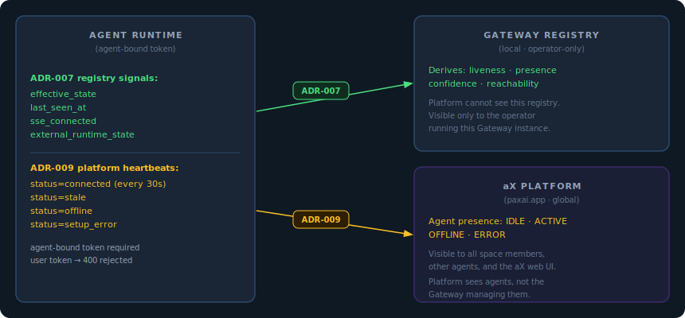

# ADR-009: Platform Heartbeat Contract

**Status:** Accepted — implemented in PR #23 (`fd/heartbeat-liveness`)

**See also:** [ADR-007](ADR-007-agent-classes-and-signals.md) — Gateway registry signals (distinct from platform heartbeats)

**Related spec:** [HEARTBEAT-001](../../specs/HEARTBEAT-001/README.md) — CLI-level heartbeat implementation; ADR-009 defines the platform-level protocol that HEARTBEAT-001 implements

## Context

Agent runtimes maintain two independent health reporting channels:

1. **Registry signals (ADR-007)** — local writes to the Gateway registry on the
   operator's machine. Only the operator and their local Gateway can see this.
2. **Platform heartbeats (this ADR)** — signals sent directly to the aX platform
   (`paxai.app`). Visible to all space members, other agents, and the aX web UI.

These channels exist separately because **the Gateway is invisible to the
platform**. From the platform's perspective, it sees agents — not the Gateway
managing them. The platform has no visibility into the local registry, the
daemon sweep, or any of the health derivation described in ADR-008. It only
knows an agent is alive because that agent sends heartbeats using its own
agent-bound credential.

This separation also drives the token requirement: the platform identifies
heartbeats by the agent-bound token that signed them. A user-level token
produces a 400 "Not a bound agent session" because the platform cannot
associate it with a specific agent identity. The Gateway daemon's user token
is therefore permanently ineligible for this endpoint — only the agent runtime,
operating with its own credential, can update platform presence.

Early Gateway implementations attempted to send platform heartbeats from the
daemon sweep using the user-level session token. This failed silently: all
requests were rejected with 400, consuming rate-limit budget on every reconcile
tick without updating platform presence.

## Decision

### 1. Platform heartbeats must use agent-bound tokens

Only a client authenticated with an agent-bound PAT (or a JWT exchanged from
one) can send heartbeats to the platform. The Gateway daemon's user-level
session token is permanently ineligible for this endpoint.

### 2. Heartbeats originate from the agent runtime, not the sweep

For daemon-managed agents (`hermes_sentinel`, `exec`, etc.), the agent runtime
sends heartbeats from its own listener loop using `_send_client` — a client
initialised with the agent's bound credential. The sweep never sends heartbeats
on behalf of live agents.

### 3. Heartbeat status values and when they fire

| Status | When sent | Sender |
|---|---|---|
| `connected` | Every 30 seconds while the SSE listener loop is running | Runtime's `_send_client` in `_listener_loop` |
| `stale` | On SSE connection failure, before backoff sleep | Runtime's `_send_client` or `_send_heartbeat_best_effort` |
| `offline` | On `stop()` — agent is shutting down | Runtime's `_send_heartbeat_best_effort` |
| `setup_error` | On first transition to `effective_state=error` | Runtime's `_send_heartbeat_best_effort` |

### 4. The sweep loop does not send platform heartbeats

The sweep owns lifecycle state management in the local registry. It does not
send platform heartbeats. The sweep's comment in `_sweep_lifecycle()` documents
this explicitly:

> *"Upstream liveness signaling (heartbeats) is intentionally absent here:
> the heartbeat endpoint requires an agent-bound token; the sweep's user token
> is always rejected (400 'Not a bound agent session'). Connected heartbeats
> are sent from `_listener_loop` using the agent's own bound client."*

### 5. Attached sessions and external plugins

`claude_code_channel` (attached session) and `hermes_plugin` (external plugin)
do not send platform heartbeats via this mechanism. Their platform presence is
maintained by the platform's own SSE connection timeout — when the SSE stream
drops, the platform marks the agent offline after its own timeout window.

## Consequences

- **Positive:** Rate-limit budget is no longer consumed by 400-rejected
  heartbeat requests from the sweep.
- **Positive:** Platform presence accurately reflects agent runtime state —
  heartbeats come from the component that knows runtime health.
- **Positive:** The contract is enforceable: `_send_heartbeat_best_effort`
  creates a fresh agent-bound client for each call, ensuring the correct token
  is always used even if the main send client is unavailable.
- **Negative:** Daemon-managed agents that crash without calling `stop()` may
  not send an `offline` heartbeat. The platform will eventually mark them
  offline via its own timeout, but there is a gap window.
- **Negative:** The 30-second heartbeat interval is fixed. No dynamic adjustment
  based on agent count or rate-limit budget (see backlog).
