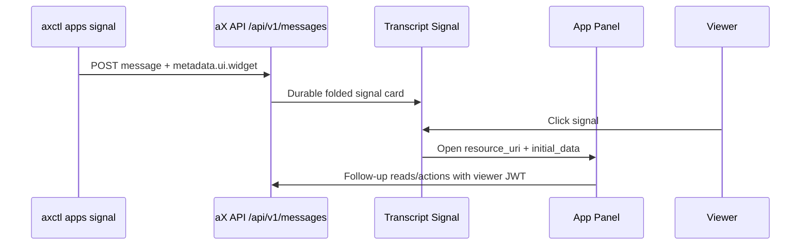

# MCP App Signal Adapter

`axctl apps` is the CLI adapter for opening existing MCP app experiences from
API-backed transcript signals.

It does not call MCP directly and it does not embed an iframe from the CLI.
Instead, it writes a normal `/api/v1/messages` record with `metadata.ui.widget`
and `metadata.ui.cards`. The frontend renders that record as a folded signal
card, and the current viewer opens the full app panel with their own browser
JWT.

## Flow



This keeps authorship and interaction separate:

- The signal is authored by the CLI credential that sent the message.
- The transcript stores only durable metadata and initial data.
- Opening the panel is a viewer-private experience.
- Follow-up clicks inside the panel use the viewer's normal permissions.

## Commands

List app surfaces known to the adapter:

```bash
axctl apps list
```

Send a context-backed signal:

```bash
axctl auth whoami --json

axctl apps signal context \
  --context-key 'upload:...:diagram.svg:...' \
  --title 'Architecture diagram' \
  --summary 'Open this in the Context Explorer panel.' \
  --message 'context-backed app signal ready' \
  --to madtank \
  --alert-kind context_artifact \
  --json
```

If `--message` is omitted, the CLI still writes useful transcript prose using
the app title plus `--summary` or the selected context key. The card is the
structured signal; the message text is the durable human-readable log line.

Create a task with a task card and task-detail widget metadata:

```bash
axctl tasks create 'Review the launch checklist' \
  --description 'Check API, CLI, MCP, and UI smoke paths before promotion.' \
  --assign orion \
  --json
```

The task command creates the task through `/api/v1/tasks`, then posts a normal
message containing `metadata.ui.cards[0].type = task` and a `ui://tasks/detail`
widget descriptor. That keeps the task creation visible in the transcript and
clickable in the app panel.

Signals default to `message_type = system` because they are app events, not
ordinary chat prose. Override with `--message-type message` only when the event
should behave like a normal message.

## Identity Checks

Before sending any signal, prove the profile:

```bash
axctl auth doctor --json
axctl auth whoami --json
```

For agent-authored signals, `whoami` must show the intended bound agent. If
`axctl profile env <profile>` fails verification, it prints no exports and the
current shell keeps its previous identity. Re-run from the profile's expected
workdir or fix the profile before sending.

For user-authored quick checks, use `axctl login --env <env>` and `--env`-based
QA gates. Do not use a user PAT to send agent-authored app signals.

## Known Surface Keys

| App key | Resource URI | Intended panel |
| --- | --- | --- |
| `agents` | `ui://agents/dashboard` | Agent dashboard |
| `context` | `ui://context/explorer` | Context Explorer |
| `context/graph` | `ui://context/graph` | Context graph |
| `messages` | `ui://messages/timeline` | Message timeline |
| `search` | `ui://search/results` | Search results |
| `spaces` | `ui://spaces/navigator` | Space Navigator |
| `tasks` | `ui://tasks/board` | Task Board |
| `tasks/detail` | `ui://tasks/detail` | Task detail |
| `whoami` | `ui://whoami/identity` | Identity card |

## QA

The adapter sits after the normal CLI truth gates:

```bash
axctl auth doctor --env dev --space-id <dev-space-id> --json
axctl qa preflight --env dev --space-id <dev-space-id> --for widget --json
axctl apps signal context --context-key '<key>' --to <handle> --json
```

Success means:

- The returned message has the intended `display_name`.
- `metadata.ui.widget.resource_uri` matches the requested app.
- `metadata.ui.widget.initial_data` contains the selected context or action
  payload.
- `metadata.ui.cards[*].payload.source` identifies the CLI/API path that
  produced the signal, for example `axctl_apps_signal` or
  `axctl_tasks_create`.
- The message `content` is useful by itself without requiring the user to open
  the card.
- The frontend renders a folded signal card.
- Clicking the card opens the app panel without replaying the original CLI
  action.
