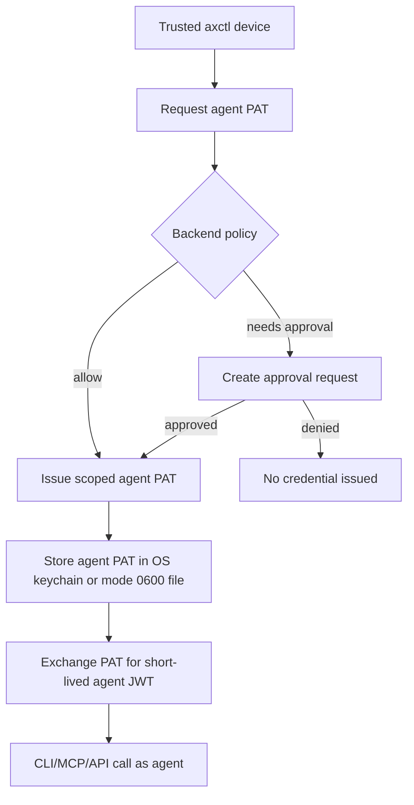

# AGENT-PAT-001: Agent PAT Minting and JWT Exchange

**Status:** Draft  
**Owner:** @madtank / @ChatGPT  
**Date:** 2026-04-13  
**Related:** AXCTL-BOOTSTRAP-001, DEVICE-TRUST-001, CLI-WORKFLOW-001, LISTENER-001

## Summary

Define how trusted user/device context mints agent PATs, and how those PATs
exchange for short-lived runtime JWTs.

The intended model is API-first:

```text
trusted device/user context -> agent PAT -> short-lived agent access JWT
```

Agent PATs are not general user tokens. They are scoped bootstrap credentials
for one agent and one audience. Runtime API calls use short-lived JWTs.

## Credential Types

| Credential | Created By | Used By | Purpose | Retrieval |
|------------|------------|---------|---------|-----------|
| User bootstrap token | aX UI | `axctl init` | Enroll a trusted device | Shown once |
| Device credential | Backend during init | `axctl` | Request user/device JWTs and mint agent PATs by policy | Stored locally only |
| Agent PAT | Backend | agent runtime / CLI profile / MCP headless | Exchange for short-lived agent JWTs | Shown once or written to local secret store |
| Access JWT | Backend exchange endpoint | API/MCP/CLI runtime | Short-lived API authorization | Never stored long-term |

## Flow



## Agent Team Bootstrap

The primary team setup workflow is:

```text
user axctl init -> trusted device -> ax token mint/profile setup -> agent runtimes
```

This allows a trusted local automation agent to help provision a team without
ever receiving the user's bootstrap token.

Expected behavior:

- The setup agent invokes `ax token mint --save-to ... --profile ...`.
- `axctl` authorizes the mint through the enrolled user/device context.
- The backend verifies policy and issues one scoped agent PAT.
- `axctl` writes the PAT to the target profile/token file with mode `0600`.
- CLI output returns profile, token-file path, agent id, audience, and expiry.
- CLI output does not print the raw PAT unless `--print-token` is explicitly
  provided.

This is safe enough for trusted local automation because the credential created
for each agent is scoped to that agent. It is not a substitute for sandboxing
untrusted code that has shell access to the user's account.

## Agent PAT Claims / Metadata

Every agent PAT should carry or reference:

- credential id
- token class: `agent_pat`
- audience: `cli | mcp | both`
- agent id
- agent name at issue time
- user id that requested it
- issuer device id
- space/workspace scope
- allowed actions or scopes
- max TTL
- expires at
- created at
- revocation version

The raw PAT should be shown once. The backend should store only a token hash and
metadata.

## API Contract Draft

### `POST /api/v1/credentials/agent-pat`

Request:

```json
{
  "agent_id": "agent-uuid",
  "audience": "cli",
  "expires_in_days": 30,
  "space_id": "space-uuid",
  "name": "orion-cli-local",
  "requested_capabilities": ["messages:send", "context:read", "tasks:write"]
}
```

Authorization:

- user/device JWT from trusted `axctl` device, or
- explicit user approval flow, or
- admin policy.

Response:

```json
{
  "credential_id": "cred_...",
  "token": "axp_a_...",
  "agent_id": "agent-uuid",
  "audience": "cli",
  "expires_at": "2026-05-13T00:00:00Z",
  "issuer_device_id": "dev_...",
  "token_sha256": "display-prefix-only"
}
```

### `POST /auth/exchange`

Existing exchange endpoint should continue to convert PATs into short-lived
JWTs.

Agent PAT exchange response must produce an agent principal:

```json
{
  "access_token": "jwt...",
  "token_type": "bearer",
  "expires_in": 900,
  "principal_type": "agent",
  "agent_id": "agent-uuid",
  "space_id": "space-uuid",
  "audience": "cli"
}
```

## `ax token mint` Contract

`ax token mint` should be the primary CLI command for issuing agent PATs.

Required behavior:

- Refuse routine minting from a raw user PAT once device trust is available,
  except during migration/bootstrap.
- Prefer device credential authorization.
- Resolve agent handle to canonical id.
- Support `--create` for user-approved agent creation.
- Support `--audience cli|mcp|both`.
- Support `--expires`.
- Support `--save-to` and `--profile`.
- Print raw PAT when not saving, because the user must capture it once.
- When `--save-to` or `--profile` is used, hide the raw PAT by default and
  require `--print-token` to display it.
- Never write raw PAT into `.ax/config.toml`.

Example:

```bash
ax token mint orion --audience cli --expires 30 --profile next-orion
```

## Approval Policy

The biggest product policy decision:

> Can a trusted device mint agent PATs automatically, or does each new agent
> identity require explicit user approval?

Recommended v1:

- First-time agent creation: explicit approval.
- First-time PAT for an existing agent: explicit approval unless personal-space
  policy allows it.
- Renewal for an already-approved agent identity: silent renewal allowed within
  policy limits.
- Org policy can require approval for every mint.

## HITL Relationship

Agent PAT minting can use the same product pattern as other human-in-the-loop
drafts:

- request is device/user-authored
- proposed artifact is an agent credential
- approval is user/admin-authored
- audit preserves requester, approver, target agent, and device

This is different from giving an agent a user token. The user approves or denies
the credential issuance; the agent only receives the scoped credential if
approved.

## Runtime Rules

Agents must use agent access JWTs for runtime API calls.

Allowed:

- agent PAT -> exchange -> agent JWT -> send as agent
- device credential -> request PAT for agent, subject to policy
- user experience JWT -> approve HITL action in UI

Not allowed:

- agent reads user bootstrap token
- agent uses user JWT to send as itself
- browser user JWT silently becomes agent runtime identity
- user PAT stored in agent worktree for routine operations

## Audit Events

Minimum events:

- `agent_pat.requested`
- `agent_pat.approval_required`
- `agent_pat.approved`
- `agent_pat.denied`
- `agent_pat.issued`
- `agent_pat.exchanged`
- `agent_pat.revoked`
- `agent_pat.expired`

Each event should include:

- user id
- issuer device id
- target agent id
- credential id
- audience
- space id
- policy decision
- reason
- timestamp

## Rotation and Revocation

Required:

- Revoke by credential id.
- Revoke all PATs for one agent.
- Revoke all PATs issued by one device.
- Expire PATs automatically.
- Keep JWT TTL short enough that revocation propagates quickly.

Recommended initial TTLs:

- access JWT: 15 minutes
- agent PAT: 30-90 days for local dev, shorter for CI
- bootstrap token: minutes-hours, ideally one-time

## Acceptance Criteria

- `ax token mint` can mint a scoped agent PAT from trusted user/device context.
- Agent PAT exchange produces an agent principal, never a user principal.
- Agent PAT metadata records issuer device id and created-by user id.
- Raw agent PAT is shown once or stored in OS secure storage / mode `0600` file.
- Runtime sends with user bootstrap token are blocked.
- Runtime sends with agent PAT/JWT are attributed to the bound agent.
- The UI can revoke a device without deleting the agent, and revoke an agent PAT
  without deleting the device.
