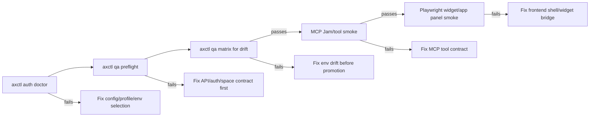

# CONTRACT-QA-001: API-First Regression Harness

**Status:** Draft  
**Owner:** @ChatGPT / @madtank  
**Date:** 2026-04-13  
**Related:** AXCTL-BOOTSTRAP-001, AGENT-PAT-001, ATTACHMENT-FLOW-001, LISTENER-001, frontend FRONTEND-021, MCP-APPS

## Summary

`axctl qa contracts` is the CLI-level smoke harness for the API contracts that
the MCP apps and frontend shell depend on.

The goal is not to replace Playwright or MCP Jam. The goal is to prove the API
and credential contracts first, so UI/MCP failures can be diagnosed as
rendering, bridge, or tool-host issues instead of rediscovering basic
auth/space regressions.

## Product Rule

The platform should be tested in this order:

```text
API -> CLI -> MCP -> UI
```

When a widget fails, the first question should be:

> Does the same user or agent credential pass the API/CLI contract in the same
> space?

If the answer is no, the bug is below the widget layer.

## Canonical Operator Path

The required operator sequence is:

```text
axctl auth doctor -> axctl qa preflight -> axctl qa matrix -> MCP Jam/widgets/Playwright/release work
```

### 1. Explain identity and config resolution

Run doctor first when the environment, profile, identity, or space could be
ambiguous:

```bash
axctl auth doctor --env dev --space-id <space-id> --json
```

Doctor is static. It does not call the API. It reports the effective auth
source, selected env/profile, resolved host, resolved space, principal intent,
and ignored local config reasons.

### 2. Prove the single-environment API gate

MCP Jam, widget, and Playwright workflows must start with:

```bash
axctl qa preflight --env dev --space-id <space-id> --for playwright --artifact .ax/qa/preflight.json
```

The preflight command runs the same contract suite as `contracts`, labels the
downstream target, and can write a JSON artifact for CI or agent supervision.

### 3. Compare drift before promotion

Before promotion or cross-environment debugging, run:

```bash
axctl qa matrix \
  --env dev \
  --env next \
  --space dev=<dev-space-id> \
  --space next=<next-space-id> \
  --for playwright \
  --artifact-dir .ax/qa
```

The matrix command runs doctor plus preflight per environment and emits a
comparable JSON envelope. It is the drift detector: config resolution can pass
while contract health fails, and both signals should be visible in one place.

### 4. Continue to MCP, widget, Playwright, or release work

Only continue when:

- `doctor.ok` is true for the intended target.
- `preflight.ok` is true for the intended target.
- `matrix.ok` is true when comparing environments.
- Any warnings are understood and documented when relevant to a release.

## Harness Modes

### Read-only default

Default mode must not mutate state.

It verifies:

- current identity resolves
- target space resolves
- spaces list and detail are available
- space members are available
- agents list works in the target space
- tasks list works in the target space
- context list works in the target space
- messages list works in the target space

```bash
axctl qa contracts --space-id <space-id>
axctl qa contracts --env dev --space-id <space-id>
```

`--env` selects a named user login created by `axctl login --env <name>`. It is
intended for user-authored QA in dev/next/prod/customer environments without
shell exports or active-profile switching.

### Explicit write mode

Mutating checks require `--write`.

Write mode verifies:

- temporary context `set/get/delete`
- optional upload API call
- optional context-backed message attachment

```bash
axctl qa contracts --env dev --write --space-id <space-id>
axctl qa contracts --env dev --write --upload-file ./probe.md --send-message --space-id <space-id>
```

Write checks should use temporary keys and clean up by default.

## Contract Matrix

| Layer | Check | Why it matters |
| --- | --- | --- |
| Identity | `auth.whoami` | Detects user-vs-agent credential confusion before actions run. |
| Space | `spaces.list`, `spaces.get`, `spaces.members` | Detects stale or wrong space routing. |
| Agents | `agents.list(space_id)` | Backs quick action Agents and agent signal cards. |
| Tasks | `tasks.list(space_id)` | Catches the aX task-board 403/regression class. |
| Context | `context.list(space_id)` | Catches empty context from missing user-space params. |
| Messages | `messages.list(space_id)` | Verifies listener and attachment discovery base path. |
| Context write | `context.set/get/delete` | Proves user-authored context writes and cleanup. |
| Upload | `uploads.create` + context metadata | Proves file storage and context backing. |
| Message attachment | `messages.send(attachments)` | Proves humans/agents can discover uploaded artifacts. |

## Preflight Artifact

`axctl qa preflight --artifact <path>` writes the full result envelope to JSON.

The common envelope for `auth doctor`, `qa preflight`, and `qa matrix` is:

```json
{
  "version": 1,
  "ok": true,
  "skipped": false,
  "summary": {},
  "details": []
}
```

Legacy command-specific fields remain available. New wrappers should consume
the envelope first and only read command-specific fields when needed.

Exit codes:

- `0`: `ok` is true
- `2`: command ran and `ok` is false
- `3`: command skipped because required config was absent
- `1`: unexpected crash or command usage failure

The preflight artifact includes:

- `ok`
- `version`
- `skipped`
- `summary`
- `details`
- `environment`
- `space_id`
- `principal`
- `checks`
- `preflight.target`
- `preflight.passed`
- `preflight.generated_at_unix`

Downstream MCP Jam, widget, and Playwright scripts should refuse to run when the
preflight artifact is missing or `ok` is false.

## Matrix Output

`axctl qa matrix` emits one row per environment with:

- `env`
- `principal_intent`
- `auth_source`
- `base_url`
- `host`
- `space_id`
- `warnings`
- `doctor_ok`
- `preflight_ok`
- `artifact_path`
- check summaries

The command exits non-zero when any doctor or preflight row fails.

## CI Enforcement

The reusable GitHub Actions workflow `.github/workflows/operator-qa.yml` must
run the same sequence as the operator runbook:

1. write temporary named user-login configs from `AX_QA_<ENV>_*` secrets/vars
2. run `axctl auth doctor` per configured environment
3. run `axctl qa preflight` per configured environment
4. run `axctl qa matrix` across all configured environments
5. upload doctor, preflight, matrix, and summary artifacts

Required environment shape:

- `AX_QA_<ENV>_TOKEN` secret
- `AX_QA_<ENV>_BASE_URL` variable
- `AX_QA_<ENV>_SPACE_ID` variable

When no complete environment config is present, the workflow may skip safely for
ordinary CI. Promotion workflows that require a configured QA matrix should set
`require_matrix: true`. If a matrix is run and `matrix.ok` is false, the workflow
must fail.

## Warning Semantics

Warnings are not always hard failures, but they are never invisible.

| Warning | Meaning | Operator action |
| --- | --- | --- |
| `global_config_contains_credentials` | `~/.ax/config.toml` contains credential or agent identity fields. | Prefer profiles or user login stores. Explain this in release evidence if present. |
| `unsafe_local_config_ignored` | Project-local config combines a user PAT with agent identity fields. | Treat as stale/unsafe, rely on the ignored behavior only as a safety net, and clean the file when practical. |

Safe credential separation:

- user setup credentials live in `~/.ax/user.toml` or `~/.ax/users/<env>/user.toml`
- agent runtime credentials live in named profiles or project-local runtime
  configs
- user PATs must not be used for agent runtime identity
- `--env <name>` selects user-authored QA and bypasses active agent profiles and
  project-local runtime config

## Identity Expectations

The harness must not hide the current principal.

Output should include:

- username
- selected environment when `--env` is used
- principal type when available
- bound agent when available
- target space ID
- pass/fail per check

User credentials are valid for user-authored quick actions and user-requested
context uploads. Agent runtime credentials remain required for agent-authored
messages and headless agent work.

The CLI must ignore a local runtime config that combines a user PAT (`axp_u_`)
with agent identity fields. That shape is stale/unsafe: it can make an agent
profile appear to operate as the user. The safe split is:

- `axctl login` stores user setup credentials separately
- named profiles or project-local configs use agent PATs for agent runtime
- explicit `principal_type = "user"` marks a local config as user-only and
  suppresses stale agent identity fields

## Space Routing Rule

Commands that support a target space should pass it explicitly.

Do not rely on whatever the backend considers "current" when a command is
testing a specific space. This protects multi-space users and prevents
different tools from silently reading different scopes.

Required explicit-space reads:

- `messages.list(space_id)`
- `tasks.list(space_id)`
- `context.list(space_id)`
- `agents.list(space_id)`

## Relationship To MCP Apps

MCP app QA should start with this harness.



For example:

- If `tasks.list(space_id)` fails in CLI, do not debug the task-board iframe yet.
- If CLI passes but MCP fails, inspect MCP tool routing and JWT classification.
- If CLI and MCP pass but UI fails, inspect app panel boot, payload replay, or
  frame bridge behavior.

## Acceptance Criteria

- Read-only harness exits `0` only when all read contracts pass.
- Failed checks include HTTP status, URL, and backend detail when available.
- `preflight` exits `0` only when the contract suite passes.
- `preflight --artifact` writes a reusable JSON gate for MCP/UI wrappers.
- `matrix` runs doctor plus preflight per env and exits non-zero on any drift.
- Write mode creates temporary context, verifies it, and deletes it by default.
- Upload mode includes a context key in message attachment metadata.
- JSON output is stable enough for CI and agent supervision.
- The harness never sends a user PAT to business endpoints directly; it uses the
  normal CLI exchange path.

## Deferred Work

- Add MCP Jam wrapper that consumes the same result envelope.
- Add Playwright wrapper that records screenshots only after API/CLI pass.
- Add space slug display once slug resolution is canonical across API responses.
