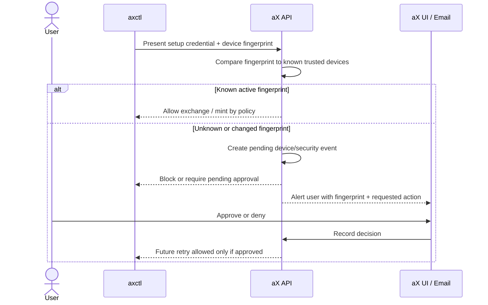

# DEVICE-TRUST-001: Device Trust and Approval

**Status:** Draft  
**Owner:** @madtank / @ChatGPT  
**Date:** 2026-04-13  
**Related:** AXCTL-BOOTSTRAP-001, AGENT-PAT-001, docs/credential-security.md

## Summary

Define the trust model for devices that run `axctl`.

The device is the trust anchor for local CLI operation. The user bootstrap token
establishes the device once; after that, authorization decisions should be based
on a registered device public key, device credential, user policy, and audit
history.

This replaces the weaker idea of letting a trusted agent read or reuse a user
token. Agents receive agent-scoped credentials. Devices request them.

## Core Principle

```text
User bootstrap token -> device trust
Device trust -> agent PAT minting policy
Agent PAT -> short-lived access JWT
```

No arrow points from agent back to raw user token material.

## Device Record

Each enrolled device should have:

- `device_id`
- `user_id`
- `public_key`
- `public_key_fingerprint`
- `display_name`
- `platform`
- `first_seen_at`
- `last_seen_at`
- `last_ip_hash` or coarse network metadata, if retained
- `status`: `pending | active | suspended | revoked`
- `capabilities`: policy grants such as `mint_agent_pat`
- `revocation_version`

## Device Fingerprint

The UI should show a stable fingerprint derived from the public key, not from a
raw token hash.

Recommended display:

```text
SHA256: 4F2A 91C7 9B10 55E0
```

Why public-key fingerprint:

- It identifies the device keypair.
- It does not expose token material.
- It can be shown safely in terminal and UI.
- It proves continuity across future requests.

Why not raw token hash as the primary trust anchor:

- A token hash does not prove where the token is used.
- Copied token material has the same hash from every machine.
- Public-key signatures prove possession of the device private key.

## Approval Model

### v1 Default

- `axctl init` enrolls a device from a valid bootstrap token.
- First-time agent creation or first-time agent PAT minting may require explicit
  user approval depending on policy.
- Silent renewal is allowed only for already-approved agent identities and
  still emits audit events.
- If a credential is presented from an unknown device fingerprint, the backend
  should fail closed into a pending approval state rather than silently allowing
  the request.

### Policy Variants

| Policy | Behavior |
|--------|----------|
| Personal permissive | Trusted device can mint PATs for the user's own agents. |
| Team explicit | Trusted device can request PATs, but first-time agent identity requires user/admin approval. |
| Enterprise locked | Device enrollment and PAT minting require admin approval. |

## Device Approval UI

The UI should support:

- List devices.
- Show device name, platform, created time, last used time, and fingerprint.
- Revoke device.
- Suspend device.
- Approve or deny pending device.
- Toggle whether a device may mint agent credentials.
- Show recent audit events for that device.
- Surface pending or suspicious device-use events as account alerts.
- Optionally send an email verification or security notification for first-time
  device use, changed fingerprint, or blocked mint attempts.

Example copy:

```text
Authorize new device

Device: Jacob MacBook Pro
CLI: axctl 0.4.0
Fingerprint: SHA256 4F2A 91C7 9B10 55E0
Requested access: Mint agent credentials for this workspace

[Approve] [Deny]
```

## New Device / Changed Fingerprint Flow

The intended product behavior for reused or copied bootstrap material is:



Product notes:

- The alert should identify the account, device display name, fingerprint,
  requested action, created time, and coarse origin metadata if available.
- Approval should be visible from Settings > Credentials or a future Security
  / Devices tab.
- Email can be a secondary notification channel, but the durable decision should
  live in the platform UI and audit log.
- If the user denies or ignores the request, the token/device attempt remains
  blocked.

## Request Signing

Device-authenticated requests should prove possession of the private key.

Draft header model:

| Header | Purpose |
|--------|---------|
| `X-AX-Device-ID` | Registered device id. |
| `X-AX-Device-Fingerprint` | Public key fingerprint for logging/debugging. |
| `X-AX-Device-Timestamp` | Replay window. |
| `X-AX-Device-Nonce` | Replay prevention. |
| `X-AX-Device-Signature` | Signature over method, path, body hash, timestamp, nonce. |

This can be phased in. v1 may use a device credential plus existing JWT
exchange while preserving the same device record and audit model.

## Audit Events

Minimum audit events:

- `device.enrollment_requested`
- `device.enrolled`
- `device.approved`
- `device.suspended`
- `device.revoked`
- `device.credential_used`
- `device.agent_pat_requested`
- `device.agent_pat_issued`
- `device.agent_pat_denied`

Audit record fields:

- event type
- actor user id
- device id
- space/workspace id
- target agent id, if applicable
- credential id, if applicable
- timestamp
- request fingerprint
- decision and reason

## Revocation

Revocation must be independent:

- Revoke a device without deleting agents.
- Revoke one agent PAT without revoking the whole device.
- Revoke all credentials issued by one device if it is compromised.

Recommended backend behavior:

- Device revocation increments `device.revocation_version`.
- Access JWT exchange checks device status and revocation version.
- Agent PATs include issuer device id and issuer revocation version.
- Optionally invalidate downstream agent PATs when the issuer device is revoked.

## Threats and Mitigations

| Threat | Mitigation |
|--------|------------|
| Bootstrap token copied before init | Short TTL, one-time use, audit, device approval. |
| Device credential copied from disk | OS keychain, future hardware keys, fingerprint anomaly detection. |
| Agent tries to mint more credentials | Agents do not receive user/device credential material; backend enforces issuer class. |
| Rogue device mints agent PATs | Device capability policy, audit, revocation, optional approval. |
| Replay of device request | Timestamp, nonce, request signing. |

## Acceptance Criteria

- Device records are visible and revocable in UI.
- Device fingerprint is based on public key material.
- Device credential cannot be retrieved from the backend.
- Agent PAT mint requests include issuer device id.
- Device revocation blocks future device-authenticated exchanges.
- Agents cannot request user bootstrap token material through CLI, MCP, or API.
