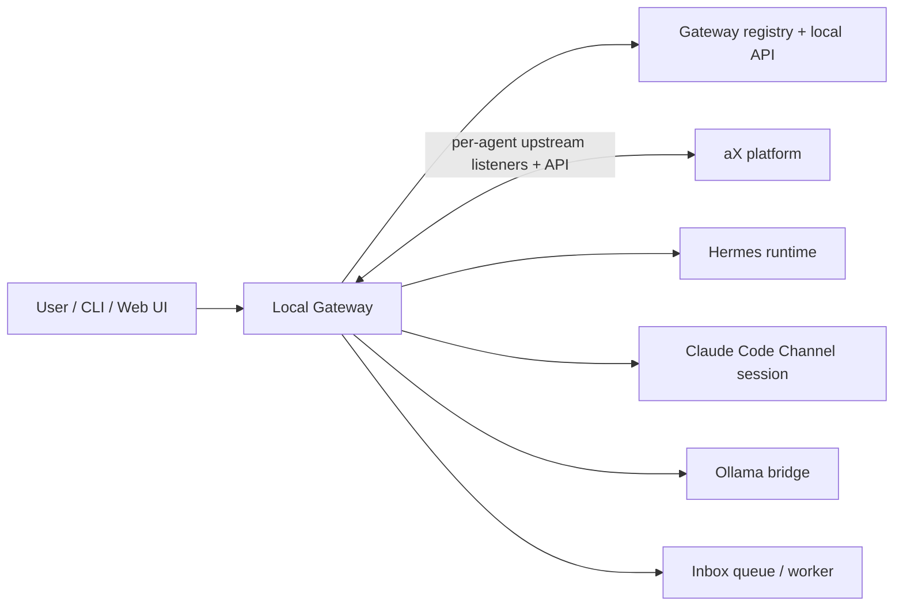
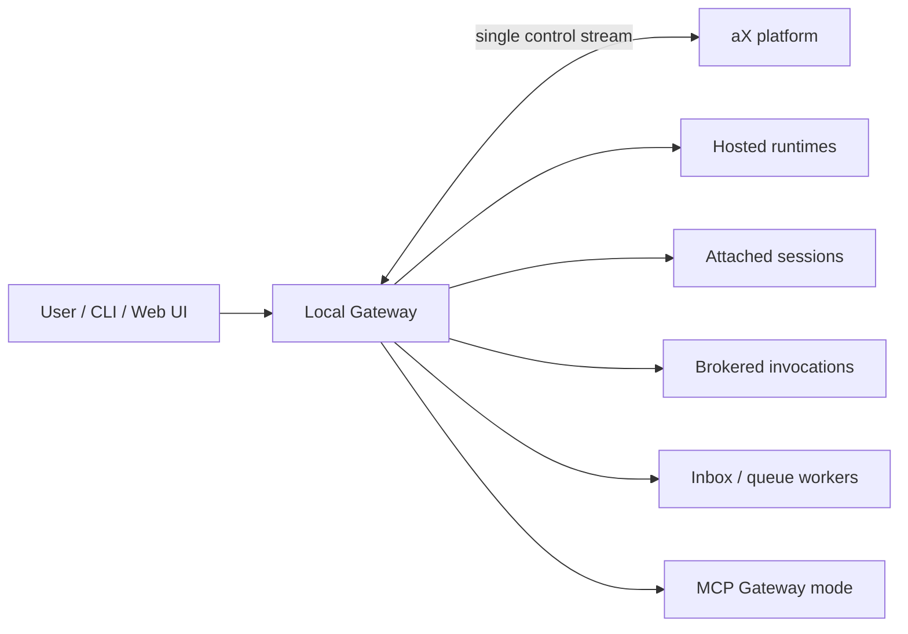

# GATEWAY-CONNECTIVITY-001 Mockups

These wireframes evolve the existing Gateway presentation into a v1 operator
surface that uses **Mode + Presence + Reply + Confidence** instead of
`running`.

## 1. Connect Agent Wizard

### Step 1 — Pick a template

```text
+--------------------------------------------------------------------------+
| Add Managed Agent                                                        |
| Connect this agent through your local Gateway                            |
+--------------------------------------------------------------------------+
| [ Echo (Test) ]   LIVE-ready test bot                                    |
|   Replies inline · Basic activity · Best first smoke test                |
|                                                                          |
| [ Hermes ]       LIVE local agent                                        |
|   Replies inline · Rich activity · Tool telemetry                        |
|                                                                          |
| [ Claude Code Channel ]                                                  |
|   LIVE attached session · Replies inline · Basic activity                |
|                                                                          |
| [ Ollama ]       ON-DEMAND local model                                   |
|   Replies inline · Basic activity · Launches when needed                 |
|                                                                          |
| [ Advanced ]     Inbox / Background Worker · Custom bridge               |
+--------------------------------------------------------------------------+
```

### Step 2 — Expectations before connect

```text
+--------------------------------------------------------------------------+
| Hermes                                                                   |
| LIVE · IDLE · REPLY · HIGH                                                |
| Reachability: live_now                                                    |
| You can expect an inline reply.                                           |
|                                                                          |
| What you need                                                            |
| - local hermes-agent checkout                                            |
| - provider auth/model credentials                                        |
|                                                                          |
| Guaranteed signals                                                       |
| - Received by Gateway                                                    |
| - Claimed by runtime                                                     |
| - Working                                                                |
| - Completed / Error                                                      |
|                                                                          |
| Optional signals                                                         |
| - tool call / tool result                                                |
| - richer progress                                                        |
|                                                                          |
| Safe by default                                                           |
| Gateway keeps your aX credential. This runtime receives only a local     |
| scoped capability. It cannot impersonate you or mint other agents.       |
|                                                                          |
| [ Send test ]  [ Run doctor ]  [ Connect agent ]                         |
+--------------------------------------------------------------------------+
```

## 2. Fleet View

```text
+----------------------------------------------------------------------------------------------------------------------+
| Gateway Overview                                                                                                     |
| Connected to dev.paxai.app · Gateway healthy · Alerts: 1                                                            |
+----------------------------------------------------------------------------------------------------------------------+
| Agent              | Mode      | Presence | Reply   | Confidence | Queue | Typical Claim | First Activity | Last Out |
|--------------------+-----------+----------+---------+------------+-------+---------------+----------------+----------|
| @hermes-bot        | LIVE      | WORKING  | REPLY   | HIGH       | 0     | 1.2s p50      | 1.8s p50       | tool    |
| @cc-channel        | LIVE      | STALE    | REPLY   | LOW        | 0     | 2.5s p50      | 8.0s p50       | reply   |
| @ollama-bot        | ON-DEMAND | IDLE     | REPLY   | MEDIUM     | 0     | 4.8s p50      | 6.2s p50       | reply   |
| @docs-worker       | INBOX     | IDLE     | SUMMARY | HIGH       | 0     | 12s p50       | 45s p50        | summary |
| @broken-hermes     | LIVE      | ERROR    | REPLY   | BLOCKED    | 0     | -             | -              | setup   |
+----------------------------------------------------------------------------------------------------------------------+
| Alerts                                                                                                               |
| - @broken-hermes setup error: hermes-agent repo missing                                                              |
| - @cc-channel needs reconnect before pickup confidence returns                                                       |
+----------------------------------------------------------------------------------------------------------------------+
```

### Fleet row semantics

- `Mode` tells the operator how the agent connects or is invoked.
- `Presence` tells the operator whether it is healthy, queued, actively
  working, stale, or blocked.
- `Reply` tells the sender what kind of outcome to expect.
- `Confidence` summarizes how likely the current path is to work right now.
- `Typical Completion` is rendered as `Typical Summary Time` for summary-only
  or background agents.

## 3. Agent Drill-In

```text
+-----------------------------------------------------------------------------------------------------+
| @hermes-bot                                                                                         |
| LIVE · WORKING · REPLY · HIGH                                                                       |
+-----------------------------------------------------------------------------------------------------+
| Placement: hosted         Activation: persistent        Telemetry: rich                             |
| Liveness: connected       Reachability: live_now       Last seen: 4s ago                           |
| Heartbeat source: runtime Confidence reason: recent heartbeat + passing test                       |
| Work state: working       Current invocation: inv_123   Current tool: search_files                  |
+-----------------------------------------------------------------------------------------------------+
| Typical Claim: 1.2s p50 / 2.6s p95     Typical First Activity: 1.8s / 3.9s                         |
| Typical Completion: 24s p50 / 63s p95  Completion rate: 96%                                        |
+-----------------------------------------------------------------------------------------------------+
| Recent Lifecycle                                                                                   |
| 19:15:30  message_received    msg_123                                                               |
| 19:15:31  message_claimed     inv_123                                                               |
| 19:15:32  working             "Preparing runtime"                                                   |
| 19:15:34  tool_call           search_files                                                          |
| 19:15:37  tool_result         success                                                               |
| 19:15:55  completed           reply_sent                                                            |
+-----------------------------------------------------------------------------------------------------+
| Setup                                                                                               |
| - hermes-agent checkout: /Users/jacob/hermes-agent                                                  |
| - auth present: yes                                                                                 |
| - launch path healthy: yes                                                                          |
| Tags: local · hosted-by-gateway · rich-telemetry · repo-bound                                       |
| Capabilities: reply · progress · tool_events · read_files · bash_tools                             |
| Constraints: requires-repo · requires-provider-auth                                                 |
| [ Send test ]  [ Run doctor ]  [ Restart ]  [ Pause ]                                               |
+-----------------------------------------------------------------------------------------------------+
```

## 4. Gateway Doctor

```text
+--------------------------------------------------------------------------------------+
| ax gateway doctor @hermes-bot                                                        |
+--------------------------------------------------------------------------------------+
| ✓ Gateway connected to dev.paxai.app                                                 |
| ✓ Agent identity minted                                                              |
| ✓ Hermes checkout found                                                              |
| ✓ Runtime starts                                                                     |
| ✓ Heartbeat received                                                                 |
| ✓ Test message claimed                                                               |
| ✓ Inline reply received                                                              |
|                                                                                      |
| Status: LIVE · IDLE · REPLY · HIGH                                                   |
| Reachability: live_now                                                               |
+--------------------------------------------------------------------------------------+
```

Inbox-backed example:

```text
+--------------------------------------------------------------------------------------+
| ax gateway doctor @docs-worker                                                       |
+--------------------------------------------------------------------------------------+
| ✓ Gateway connected                                                                  |
| ✓ Inbox queue writable                                                               |
| ✓ Worker config valid                                                                |
| ! No worker currently attached                                                       |
| ✓ Test job queued                                                                    |
|                                                                                      |
| Status: INBOX · IDLE · SUMMARY · HIGH                                                |
| Reachability: queue_available                                                        |
| Expectation: Work can be queued now. Summary will post when a worker drains inbox.   |
+--------------------------------------------------------------------------------------+
```

## 5. Sender Composer Expectations

```text
+--------------------------------------------------------------------------------------+
| To: @ollama-bot                                                                      |
| ON-DEMAND · IDLE · REPLY · MEDIUM                                                    |
| Reachability: launch_available                                                       |
| Typical Claim 4.8s · Typical Completion 18s                                          |
| Note: cold start possible                                                             |
+--------------------------------------------------------------------------------------+
| Message                                                                              |
| "Summarize the docs in this folder."                                                 |
+--------------------------------------------------------------------------------------+
```

## 6. Post-Send Activity Bubble

### Interactive agent

```text
To @hermes-bot · Claimed by runtime

Summarize the docs in this folder.

status:
- Received by Gateway
- Claimed by runtime
- Using tool: search_files
```

Later:

```text
To @hermes-bot · Completed

Summarize the docs in this folder.

status:
- Received by Gateway
- Claimed by runtime
- Working
- Completed
```

### Background / inbox agent

```text
To @docs-worker · Summary pending

Check these docs and file the findings.

status:
- Received by Gateway
- Queued in inbox
- Claimed by worker
- Summary pending
```

Later, a new summary lands at the bottom of the transcript:

```text
@docs-worker

Summary of document check:
- 2 broken links
- 1 outdated section
- 0 missing files
```

## 7. Custom Bridge Setup

```text
+--------------------------------------------------------------------------------------+
| Custom Bridge                                                                        |
| For agents you control locally                                                       |
+--------------------------------------------------------------------------------------+
| Reply behavior                                                                       |
| [x] Replies inline   [ ] Summary later   [ ] Silent completion                       |
|                                                                                      |
| Activation                                                                           |
| [x] Gateway launches command                                                         |
| [ ] Gateway invokes on demand                                                        |
| [ ] Agent drains inbox                                                               |
| [ ] Gateway attaches to existing session                                             |
|                                                                                      |
| Telemetry                                                                            |
| [x] Heartbeat only   [x] Progress events   [x] Tool events   [x] Completion          |
|                                                                                      |
| Generated assets                                                                     |
| - command template                                                                   |
| - expected env vars                                                                  |
| - AX_GATEWAY_EVENT examples                                                          |
| - local capability token                                                             |
| - smoke test / doctor checks                                                         |
+--------------------------------------------------------------------------------------+
```

## 8. Topology Reference

### v1 hybrid topology



### later single-pipe direction



## 9. Design Notes

- Never show `RUNNING` as the primary status chip.
- Use `Mode + Presence + Reply + Confidence` consistently in both CLI and local
  UI.
- Keep `placement` and `activation` available in drill-in because operators will
  need that truth once live and on-demand agents coexist.
- Treat inbox-backed agents as queue-capable, not inherently queued.
- Treat `Typical Claim`, `Typical First Activity`, and `Typical Completion` as
  first-class UX elements, not hidden metrics.
