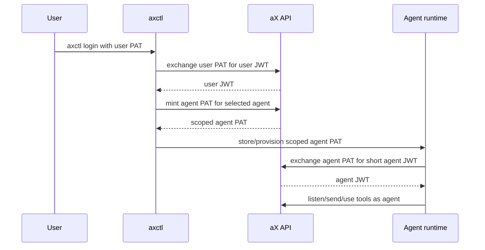

# MESH-SPAWN-001: User-Bootstrapped Agent Credential Spawning

**Status:** Draft  
**Owner:** @ChatGPT  
**Date:** 2026-04-14  
**Related:** AGENT-MESH-PATTERNS-001, AGENT-PAT-001, AGENT-CONTACT-001

## Summary

Users need a safe way to create agent identities and give them runtime
credentials. The user PAT is the bootstrap credential for that flow; the agent
PAT is the runtime credential.

The product goal is simple:

```text
user logs in -> user authorizes/spawns agent -> agent receives scoped PAT
-> agent exchanges for short JWTs -> agent joins the mesh
```

The user token should not become the agent runtime token.

## Credential Chain



## Rules

- User PATs are setup credentials.
- Agent PATs are runtime credentials.
- Agent PATs must not be able to mint unconstrained child agents.
- Agent PAT minting must produce an audit event.
- Spawned agents must have an owner, space, allowed audience, expiry, and
  revocation path.
- A spawned listener should be verified with `ax agents ping`.
- If listener verification fails, the CLI should report partial setup instead
  of pretending the mesh node is live.

## Future Composed Command

Potential command:

```bash
ax agents spawn hermes_backend \
  --space team-hub \
  --runtime hermes_sdk \
  --audience both \
  --listener sse \
  --ping-verify
```

Expected composition:

1. Verify active user login.
2. Create or find the agent record.
3. Mint scoped agent PAT.
4. Store or output the runtime credential according to the selected target.
5. Start or configure listener runtime when supported.
6. Run `ax agents ping`.
7. Emit a shared-state event with agent id, credential id, space, and contact
   mode.

## Safety Boundaries

The system should support fast local development, but the credential boundary
should stay clear:

- The user controls bootstrap.
- The agent controls runtime work.
- The supervisor coordinates work.
- Shared state records what happened.

Do not allow a random runtime agent to grow the mesh indefinitely without user
authorization or policy.

## Acceptance Criteria

- Docs describe user PAT as bootstrap, not runtime.
- CLI discovery can verify whether the spawned agent is live.
- Spawn output includes credential scope, expiry, and revocation hints.
- Failed listener verification is visible.
- The UI and CLI use the same mental model for credential creation.
